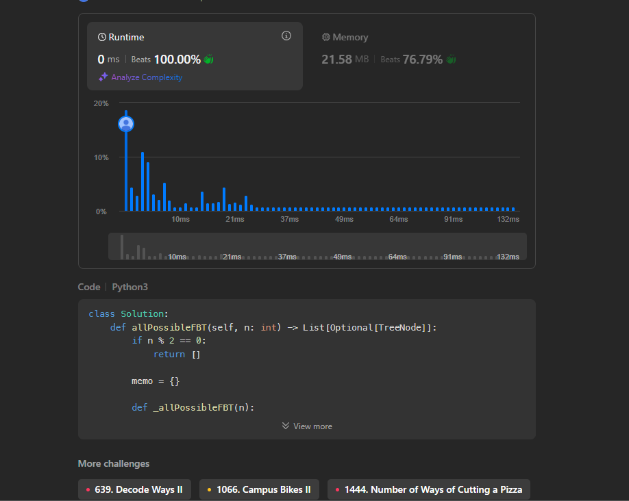
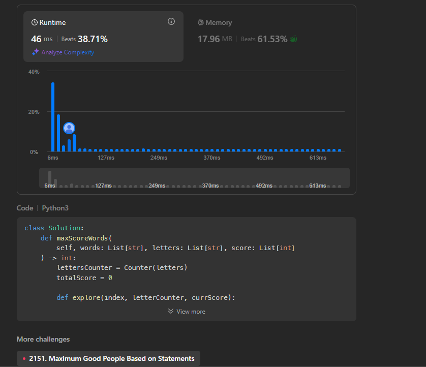
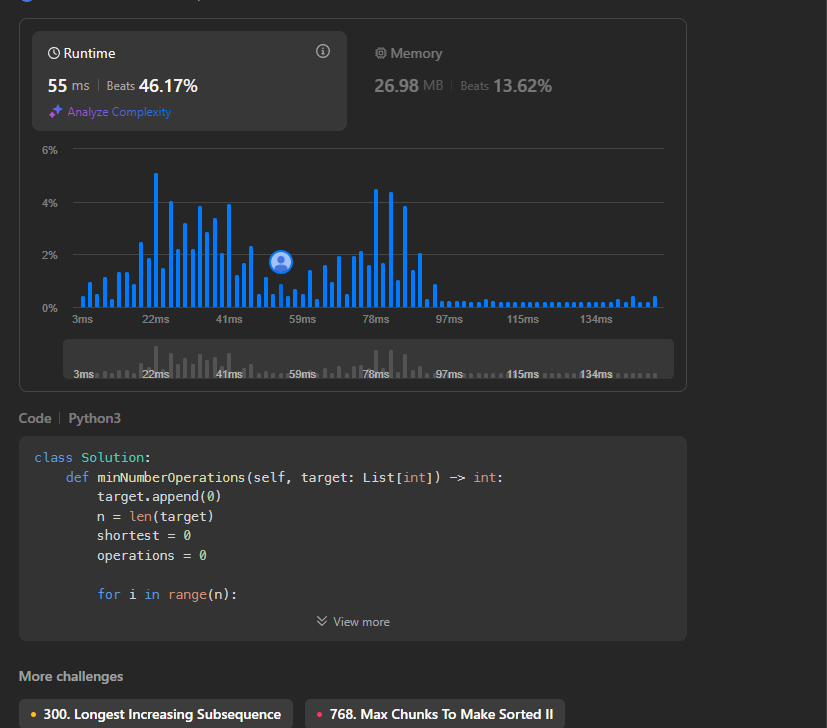

# DP_leetcode
Temas:
 - Programação Dinâmica - link do video : https://youtu.be/weNAUNvp7IE

**Conteúdo da Disciplina**:Programação Dinâmica  

## Alunos
|Matrícula | Aluno |
| -- | -- |
| 19/0039116 |  Vinicius Alves Freitas Livramento |

## Questões 

|Questão | Nível |
| -- | -- |
| [894. All Possible Full Binary Trees]([https://leetcode.com/problems/max-area-of-island/description/?envType=problem-list-v2&envId=breadth-first-search](https://leetcode.com/problems/all-possible-full-binary-trees/description/?envType=problem-list-v2&envId=dynamic-programming))  |  Médio |
| [1255. Maximum Score Words Formed by Letters]([https://leetcode.com/problems/binary-tree-maximum-path-sum/description/?envType=problem-list-v2&envId=depth-first-search](https://leetcode.com/problems/maximum-score-words-formed-by-letters/description/?envType=problem-list-v2&envId=dynamic-programming))  |  Difícil |
| [1526. Minimum Number of Increments on Subarrays to Form a Target Array]([https://leetcode.com/problems/word-ladder/description/?envType=problem-list-v2&envId=breadth-first-search&difficulty=HARD](https://leetcode.com/problems/minimum-number-of-increments-on-subarrays-to-form-a-target-array/description/?envType=problem-list-v2&envId=dynamic-programming)) |  Difícil |

## Sobre 
Realização de exercícios da plataforma de juiz eletrônico LeetCode

## Screenshots
### Problema 894

### Problema 1255

## Problema 1526

## Instalação 
**Linguagem**: Python 

